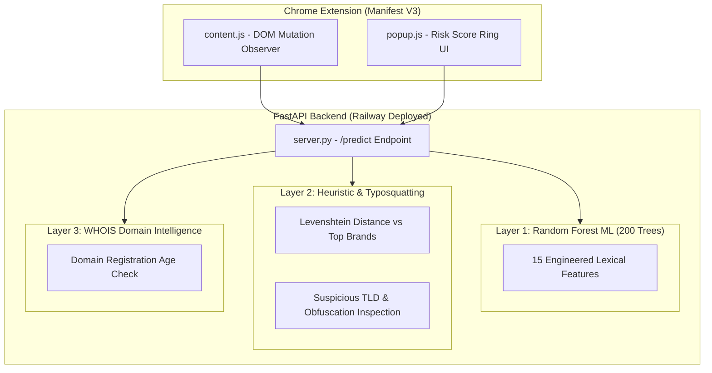

# 🛡️ PhishShield: AI-Powered Anti-Phishing System

**Chrome Extension (Manifest V3) & Multi-Layer ML Phishing Detection Backend**

[](https://developer.chrome.com/docs/extensions/mv3/)
[](https://www.python.org/)
[](https://fastapi.tiangolo.com/)
[](https://scikit-learn.org/)
[](LICENSE)

**PhishShield** is an AI-powered browser extension and real-time backend API designed to detect phishing URLs and malicious domain spoofing attempts across three defense layers: Machine Learning classification, Heuristic signal inspection, and WHOIS domain age validation.

---

## 📌 Architecture & Multi-Layer Defense



---

## 🔍 15 Engineered URL Features

| # | Feature Name | Description / Risk Indicator |
|---|---|---|
| 1 | `url_length` | Total character count (phishing URLs tend to be unusually long) |
| 2 | `domain_length` | Length of hostname portion |
| 3 | `is_typosquat` | Levenshtein distance check against top 100 brands (e.g., `paypa1.com`) |
| 4 | `dot_count` | Deep subdomain nesting indicator |
| 5 | `hyphen_count` | Hyphen-separated brand spoofing (e.g., `pay-pal-secure.com`) |
| 6 | `at_symbol` | Presence of `@` symbol in URL redirect |
| 7 | `double_slash` | Path-based redirect obfuscation |
| 8 | `https_count` | Fake HTTPS strings in URL path |
| 9 | `is_ip_address` | Raw IP address instead of registered domain |
| 10 | `domain_entropy` | Shannon entropy indicating randomly generated domain strings |
| 11 | `keyword_in_url` | High-risk terms (`login`, `verify`, `secure`, `update`, `banking`) |
| 12 | `suspicious_tld` | High-abuse TLDs (`.xyz`, `.top`, `.click`, `.site`) |
| 13 | `path_length` | Length of URL path string |
| 14 | `path_depth` | Deep path directory nesting |
| 15 | `digit_sequence` | Consecutive digit sequences in hostname |

---

## 🚀 Quickstart & Setup

### 1. Installation & Training

```bash
# Clone repository
git clone https://github.com/nayefsiddique-eng/PhishShield-AI-Guardian.git
cd PhishShield-AI-Guardian

# Install Python dependencies
pip install -r requirements.txt

# (Optional) Retrain Random Forest model on 10,000 PhishTank/Tranco samples
python train_model.py
```
*Note: Pre-trained `.pkl` model weights are committed to the repository for instant cold-start.*

### 2. Run Local Backend Server

```bash
uvicorn server:app --reload --port 8000
```
*API docs available at `http://127.0.0.1:8000/docs`.*

### 3. Load Chrome Extension

1. Open Google Chrome and navigate to `chrome://extensions/`.
2. Enable **Developer mode** in the top right.
3. Click **Load unpacked** and select the repository root directory.

---

## 🌐 API Reference

| Endpoint | Method | Description |
|---|---|---|
| `/` | `GET` | API info and version |
| `/health` | `GET` | Health check endpoint (`{"status": "ok"}`) |
| `/predict` | `POST` | Scores a URL across all 3 defense layers |

### Example Request Body:
```json
{
  "url": "http://paypa1-secure-login.xyz"
}
```

### Example Response:
```json
{
  "status": "DANGER",
  "score": 100,
  "ml_score": 97,
  "heuristic_bonus": 25,
  "flags": [
    "Suspicious TLD: .xyz",
    "Suspicious keyword: secure",
    "Typosquatting detected: paypa1.com"
  ],
  "domain": "paypa1-secure-login.xyz"
}
```

---

## 📁 Repository Structure

```
PhishShield-AI-Guardian/
├── manifest.json            # Chrome Manifest V3 configuration
├── content.js               # In-page DOM scanner & MutationObserver
├── background.js            # Extension service worker
├── popup/                   # Extension popup UI (Ring score fill animation)
│   ├── popup.html
│   ├── popup.css
│   └── popup.js
├── server.py                # FastAPI backend server
├── train_model.py           # Random Forest model training pipeline
├── phish_model.pkl          # Trained Random Forest classifier weights
├── requirements.txt
└── railway.toml             # Railway cloud deployment configuration
```

---

## 📜 License

This project is licensed under the MIT License - see the [LICENSE](LICENSE) file for details.
